# Prediction Model of Post TAVR Complication Using a Medical Twin Web Navigator
## 메디컬 트윈 기반의 post-TAVR 합병증 예측 모델 연구
1) TAVR 시술 후 발생 가능한 합병증을 예측하기 위해 실사용 데이터(RWD) 기반으로 메디컬 트윈 프레임워크를 제안하고, ML모델을 사용하여 합병증을 예측하고 분석한 결과를 TAVR 웹 네비게이터 대시보드를 통해 예측 결과와 분석 상세 내용, 피드백을 제공한다. 
2) post-TAVR 합병증을 사전에 예측하고 예방, 치료를통해 환자의 삶의 질을 향상시키는 것을 목적으로 한다.
* 병원은 대표적은 폐쇄환경으로 외부 접속이 제한되기 때문에 메디컬트윈 프레임워크를 통해 해당 부분을 보완하고, 나아가 가상공간에서 개인 맞춤형 정밀 의료, 모의 수술, 임상 시험 등 다양한 시뮬레이션을 통해 다양한 의료서비스를 효율적으로 제공 가능할 것으로 기대.
 

## 📌 목차 
> - [1. 연구의 배경 및 필요성](#1-연구의-배경-및-필요성)  
> - [2. 관련 연구](#2-관련-연구)  
>   - [2.1 TAVR](#21-tavr)  
> - [3. 연구 설계](#3-연구-설계)  
>   - [3.1 TAVR 메디컬트윈 프레임워크](#31-tavr-메디컬트윈-프레임워크)  
> - [4. 연구데이터](#4-연구데이터)  
>   - [4.1 연구데이터 수집](#41-연구데이터-수집)  
>   - [4.2 연구데이터 탐색 및 전처리](#42-연구데이터-탐색-및-전처리)  
> - [5. 실험결과](#5-실험결과)  
> - [6. 결론](#6-결론)  
> - [Appendix](#appendix)

 

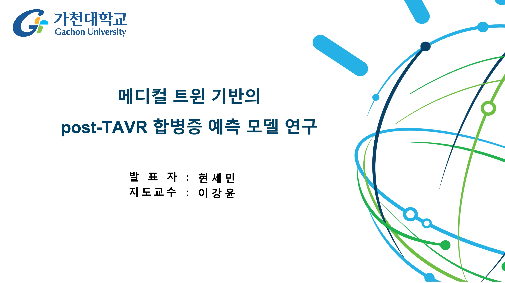

 

## 1. 연구의 배경 및 필요성
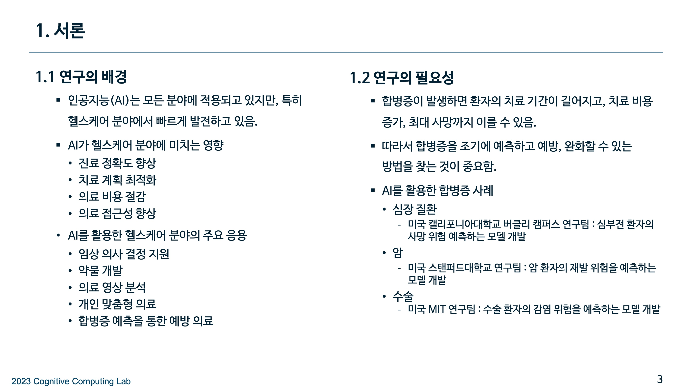

 

## 2. 관련 연구
### 2.1 TAVR
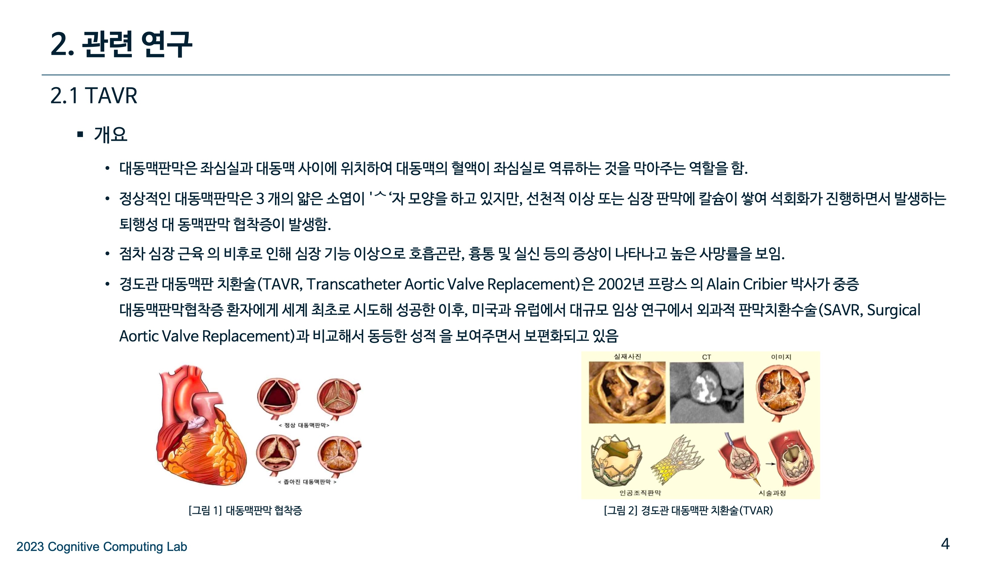
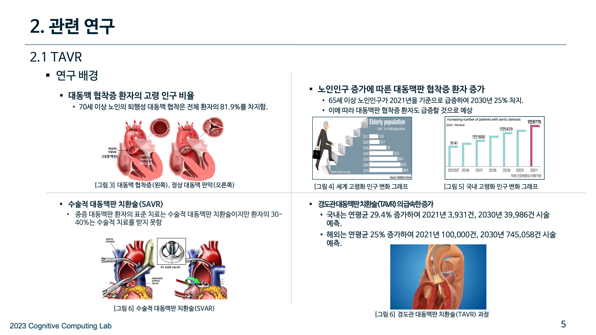
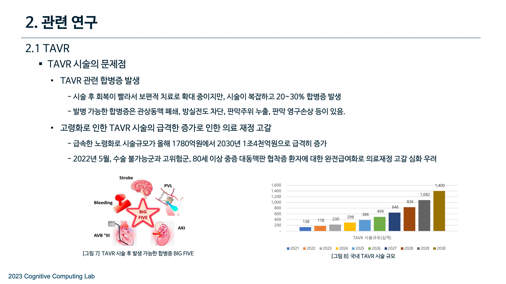
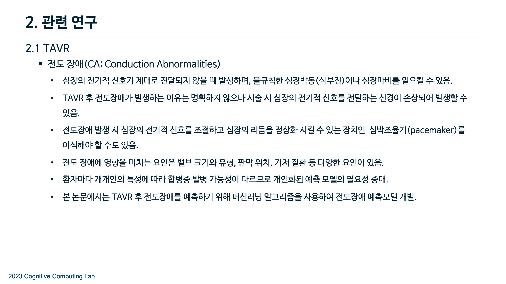

 

## 3. 연구 설계
### 3.1 TAVR 메디컬트윈 프레임워크
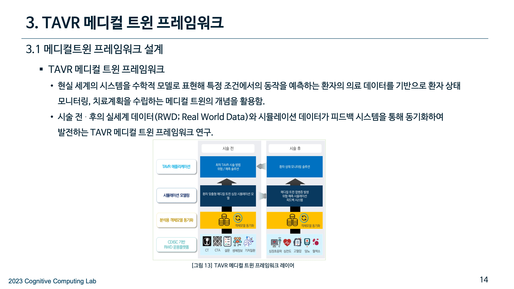
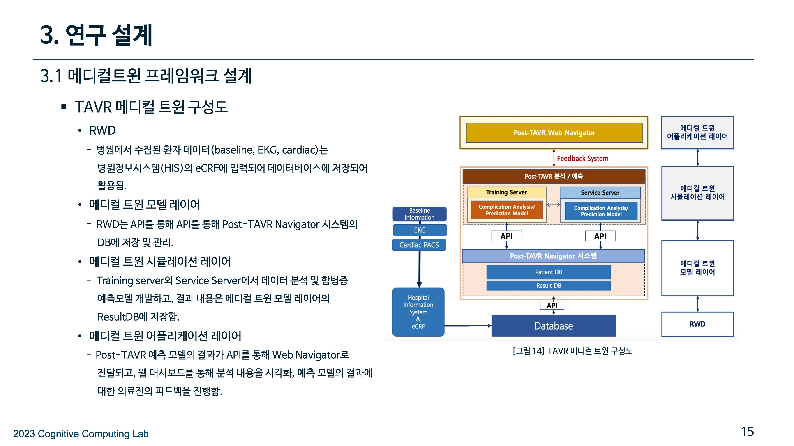

 

## 4. 연구데이터
### 4.1 연구데이터 수집
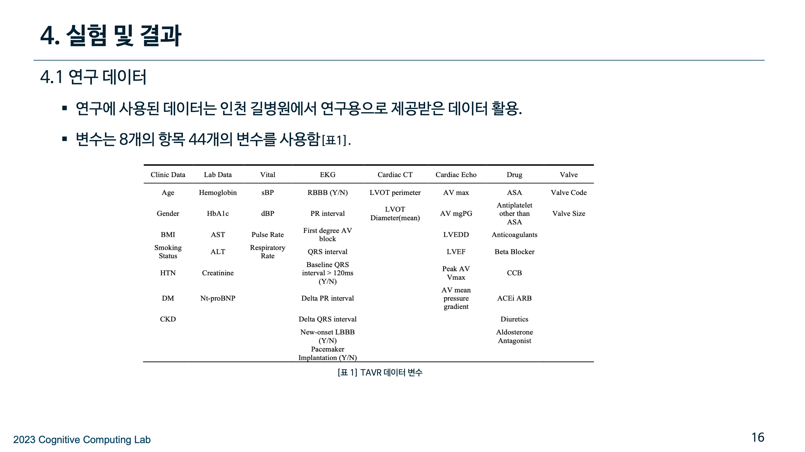

### 4.2 연구데이터 탐색 및 전처리
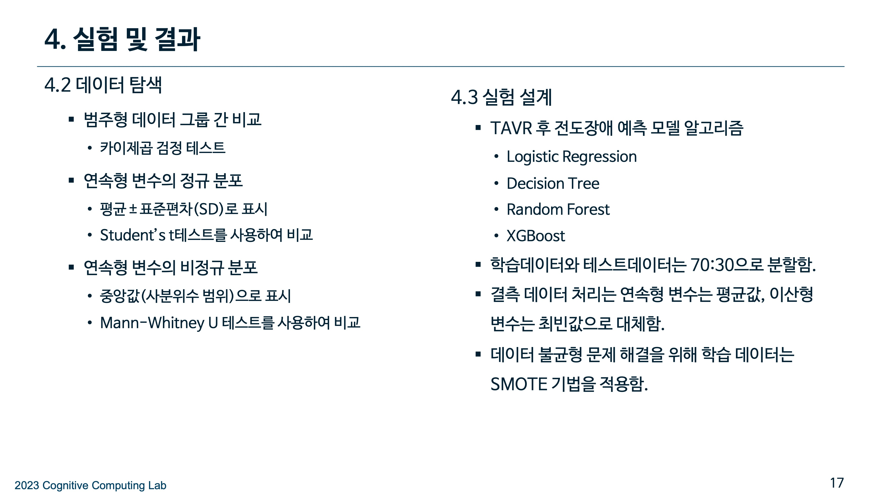

 

## 5. 실험결과
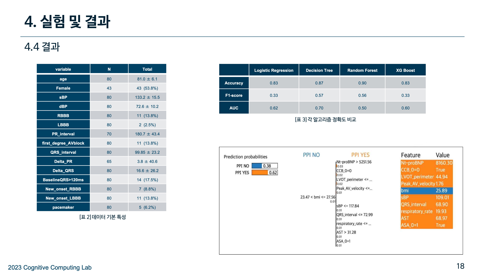
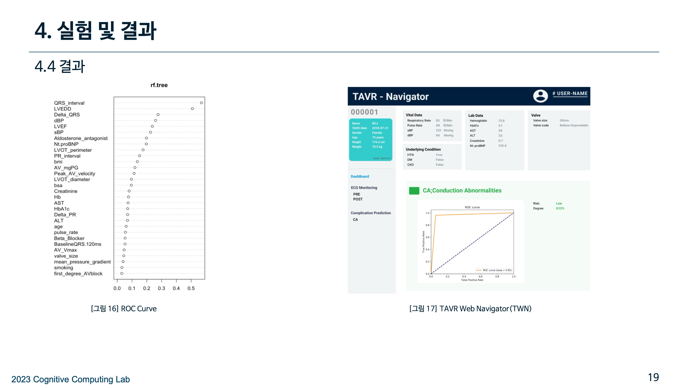

 

## 6. 결론
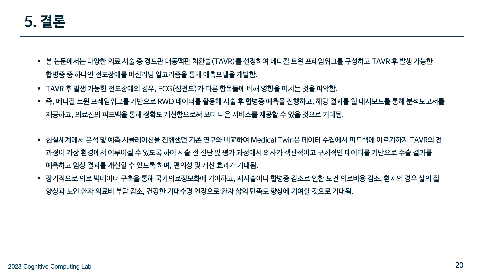

 

## Appendix
- 데이터 불균형을 처리하기 위해 기존의 SMOTE보다 K-fold 교차검증이 더 나은 성능을 보여서 K-fold 교차검증을 최종 선택함.
- 블랙박스 모델 특성으로 해당 예측 모델에 대한 결과를 직관적으로 설명하기 위해 XAI(설명가능한 AI)의 LIME을 통해 데이터의 어떤 피쳐가 예측 모델 결과에 영향을 미쳤는지 시각적으로 제공함.
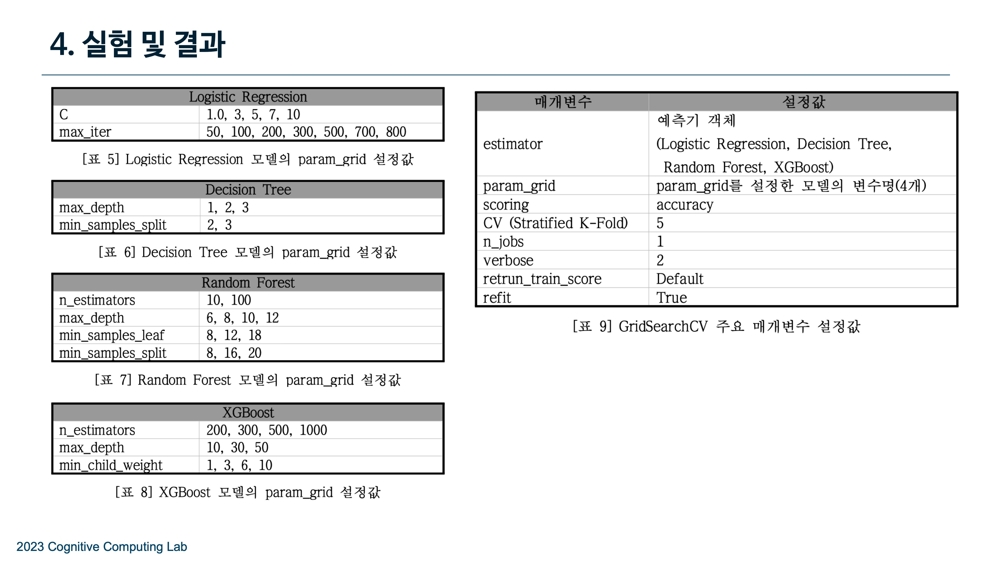

